# Especificación de Contenido y Estructura: Landing Page de LOGISPERÚ

> **Documento de Especificación de Producto y Copywriting B2B**  
> **Producto:** Portal de Homologación, Onboarding y Gestión 360° de Proveedores  
> **Empresa Distribuidora:** **LOGISPERÚ S.A.C.**  
> **Público Objetivo:** Gerencias de Compras, Logística, Finanzas y TI en medianas y grandes empresas (Perú y LATAM).

---

## 1. Estrategia de Posicionamiento y Perfil del Cliente

### Propuesta de Valor
**"Centraliza el registro, homologación y control documental de tus proveedores en un portal web seguro, reduciendo los tiempos de alta de 3 semanas a solo 48 horas."**

### Perfiles de Decisión de Compra (B2B Buyers):
- **Gerentes de Compras y Abastecimiento:** Necesitan estandarizar el catálogo de bienes/servicios, condiciones comerciales (días de crédito, moneda) y evitar cuellos de botella en compras urgentes.
- **Jefes de Logística y Cadena de Suministro:** Buscan trazabilidad inmediata, tiempos de entrega claros y cobertura por regiones.
- **Finanzas, Tesorería y Cumplimiento:** Requieren validación estricta de cuentas bancarias (CCI), datos fiscales (RUC/SUNAT), representantes legales y mitigación de riesgos de fraude.
- **Gerencia de TI / Sistemas:** Exigen soluciones listas para producción (SaaS / White-label) con arquitectura robusta, almacenamiento seguro y capacidad de integración vía API.

---

## 2. Mapa de Navegación de la Landing Page

```mermaid
graph TD
    Nav[Header / Navegación] --> Hero[1. Hero Section + Demostración]
    Nav --> Sectores[2. Sectores Industriales]
    Nav --> Problema[3. Diagnóstico: El Costo Operativo Actual]
    Nav --> Solucion[4. La Solución Integral Logisperú]
    Nav --> Modulos[5. Módulos y Funcionalidades del Sistema]
    Nav --> CasosUso[6. Aplicación por Industria en Perú]
    Nav --> Metricas[7. Métricas de Impacto Operativo]
    Nav --> Onboarding[8. Proceso de Puesta en Marcha]
    Nav --> Seguridad[9. Arquitectura y Seguridad de Datos]
    Nav --> Planes[10. Esquemas de Licenciamiento]
    Nav --> FAQ[11. Preguntas Frecuentes]
    Nav --> Contacto[12. Solicitud de Demostración]
    Nav --> Footer[13. Pie de Página Institucional]
```

---

## 3. Desglose Detallado por Sección

---

### SECCIÓN 1: Barra de Navegación Superior (Navbar)

* **Identidad Visual:** Logotipo de **LOGISPERÚ** con descriptor de línea: *Soluciones de Tecnología para la Cadena de Suministro*.
* **Navegación Principal:**
  - `Módulos` (Onboarding, Perfil 360°, Cumplimiento, Catálogos)
  - `Sectores` (Minería, Retail, Logística, Agroindustria, Construcción)
  - `Beneficios`
  - `Seguridad`
  - `Planes`
* **Acciones:**
  - **Botón Secundario (Ghost):** *Acceso al Portal* (redirección a login de clientes)
  - **Botón Primario (Sólido):** *Solicitar Demostración*

---

### SECCIÓN 2: Hero Section (Impacto Directo y Conversión)

#### Copywriting:
* **Categoría / Descriptor Funcional:** `PORTAL DE HOMOLOGACIÓN Y GESTIÓN DE PROVEEDORES`
* **Titular Principal (H1):**  
  # Centraliza, homologa y audita a tus proveedores en un solo lugar.
* **Subtítulo (P):**  
  *Elimina el intercambio manual de correos, las carpetas dispersas y el riesgo operativo. LOGISPERÚ implementa para tu empresa un portal digital marca blanca donde tus proveedores completan su registro, cargan su documentación legal y bancaria, y son aprobados en menos de 48 horas.*
* **Llamados a la Acción (CTAs):**
  - **Botón Principal:** `Solicitar Demostración Comercial` *(Abre formulario interactivo con selector de horario)*
  - **Botón Secundario:** `Ver Módulos del Sistema` *(Desplazamiento suave a la sección de funcionalidades)*
* **Puntos de Validación Clave (Metadata Bar):**
  - Validación de RUC, Representante Legal y SUNAT
  - Cuentas bancarias y códigos interbancarios (CCI) verificados
  - Almacenamiento seguro de archivos con encriptación
  - Despliegue en 5 días bajo tu propia marca y dominio

#### Componente Visual del Hero:
* **Preview de Interfaz Real:**
  - Vista limpia y en alta resolución del **Panel de Control de Compras** mostrando el listado de proveedores clasificados por estado (*Aprobado, En Revisión, Pendiente*), junto con un preview del **Formulario de Registro Autónomo** de 6 pasos.

---

### SECCIÓN 3: Sectores Industriales Atendidos

* **Encabezado:** *Solución adaptada a los estándares operativos de las principales industrias del país*
* **Grilla de Sectores:**
  - **Construcción e Infraestructura:** Control de subcontratistas, vigencia de pólizas y SCTR.
  - **Minería, Energía e Hidrocarburos:** Homologación rigurosa de estándares de seguridad, medio ambiente y compliance.
  - **Operadores Logísticos y Transporte:** Registro ágil de unidades, transportistas y cuentas de detracción.
  - **Agroindustria y Exportación:** Verificación de certificaciones técnicas, fitosanitarias y trazabilidad de insumos.
  - **Retail y Distribución Masiva:** Gestión masiva de condiciones de pago a 30/60/90 días y catálogos de productos.

---

### SECCIÓN 4: El Problema — El Costo del Registro Tradicional

* **Objetivo:** Cuantificar las ineficiencias de los métodos tradicionales frente a una solución especializada.

| Desafío Actual | Consecuencia Operativa y Financiera |
|---|---|
| **Gestión por correos y hojas de cálculo** | Documentos extraviados, información desactualizada y nula trazabilidad de aprobaciones. |
| **Tiempos de alta de 2 a 4 semanas** | Retrasos en compras críticas, proyectos detenidos y fricción con proveedores estratégicos. |
| **Cuentas bancarias no auditadas** | Riesgo de transferencias erróneas o fraudes por falta de validación de titularidad de cuenta y CCI. |
| **Vencimiento inadvertido de certificados** | Contingencias legales y multas por operar con proveedores con documentación vencida o RUC no habido. |
| **Falta de categorización comercial** | Los compradores no disponen de visibilidad clara sobre las líneas de suministro y condiciones pactadas. |

---

### SECCIÓN 5: La Solución Integral Logisperú

* **Titular de Sección:** `Control absoluto para Compras. Autonomía y agilidad para el Proveedor.`
* **Tres Ejes de Valor:**
  1. **Autoservicio para el Proveedor:** Flujo guiado en 6 pasos para cargar datos y documentos sin necesidad de soporte técnico.
  2. **Evaluación Centralizada:** Panel de control con vista 360° del proveedor, historial de interacciones y dictamen de aprobación/rechazo con notas.
  3. **Seguridad y Cumplimiento:** Registro de auditoría inmutable, control de versiones documentales y resguardo seguro en la nube.

---

### SECCIÓN 6: Módulos del Sistema

Detalle de las capacidades técnicas y funcionales de la plataforma:

#### 1. Onboarding Autónomo en 6 Pasos
* **Paso 1: Representante Legal:** Nombre, DNI, cargo, correo corporativo y teléfono de contacto.
* **Paso 2: Datos Fiscales de la Empresa:** RUC de 11 dígitos, Razón Social, Domicilio Fiscal y central telefónica.
* **Paso 3: Familias y Subfamilias:** Asignación granular de categorías de suministro (6 familias maestras y 23 subfamilias configurables).
* **Paso 4: Condiciones Comerciales:** Definición de moneda (PEN / USD), condiciones de pago (Contado, 15, 30, 60, 90 días), tiempo de entrega y cobertura geográfica.
* **Paso 5: Cuentas Bancarias:** Registro de hasta 3 cuentas (Banco, Tipo de Cuenta, Moneda, Número y Código de Cuenta Interbancario - CCI).
* **Paso 6: Expediente Digital:** Carga de archivos en formatos estándar (PDF, JPG, PNG) para Ficha RUC, Vigencia de Poder, DNI y Certificados.

#### 2. Panel de Administración y Perfil 360°
* Filtros de estado: *Pendiente, Aprobado, Rechazado, Requiere Subsanación*.
* Búsqueda por RUC o Razón Social en tiempo real.
* **Pestañas de la Ficha del Proveedor:**
  - `General`: Información corporativa y legal.
  - `Condiciones`: Términos de entrega, financiamiento y moneda acordada.
  - `Cuentas Bancarias`: Certificados y cuentas registradas.
  - `Contactos`: Directorio de ejecutivos comerciales y financieros.
  - `Documentos`: Visor y descarga de expedientes adjuntos.
  - `Historial`: Trazabilidad completa de aprobaciones, rechazos y observaciones registradas.

#### 3. Flujo de Aprobación y Auditoría
* Aprobación con un clic o rechazo fundamentado con observaciones detalladas.
* Bitácora automática que registra usuario evaluador, fecha, hora y comentarios.

#### 4. Catálogos Dinámicos de Suministro
* Configuración flexible de categorías y subcategorías según la estructura operativa de cada cliente.

#### 5. Despliegue Marca Blanca (White-Label)
* Personalización total del portal: logotipo de la empresa, paleta de colores corporativos, dominio propio (`proveedores.tuempresa.com`) y textos institucionales.

#### 6. Infraestructura y Almacenamiento Seguro
* Almacenamiento de alta performance para documentos mediante MinIO / S3 y base de datos relacional PostgreSQL con autenticación cifrada.

---

### SECCIÓN 7: Métricas de Impacto Operativo (ROI)

* **Reducción de Tiempos:** Disminución del 80% en el ciclo de alta y homologación de proveedores.
* **Cero Errores en Pagos:** Verificación formal de cuentas bancarias y CCI antes de emitir cualquier orden de compra.
* **Ahorro de Tiempo:** Reducción de hasta 12 horas semanales por analista de compras en tareas administrativas.
* **Auditoría Permanente:** 100% de expedientes digitalizados y disponibles para revisiones tributarias e internas.

---

### SECCIÓN 8: Proceso de Implementación

Despliegue ágil en 4 etapas:

1. **Definición y Marca (Día 1-2):** Configuración de identidad visual, requisitos documentales y familias de compra.
2. **Habilitación de Entorno (Día 3-4):** Configuración de servidor dedicado, base de datos y cuentas administrativas.
3. **Capacitación Operativa (Día 5):** Sesión de inducción técnica para el equipo de compras y abastecimiento.
4. **Puesta en Producción:** Lanzamiento del enlace de registro para la homologación de la base de proveedores.

---

### SECCIÓN 9: Modelos de Licenciamiento Comercial

| Característica | Plan Professional | Plan Enterprise | Dedicated / Private Cloud |
|---|---|---|---|
| **Enfoque** | Empresas con hasta 250 proveedores | Operaciones corporativas con alto volumen | Grupos empresariales y mineras |
| **Capacidad de Proveedores** | Hasta 250 proveedores | Ilimitados | Ilimitados |
| **Usuarios Administradores** | Hasta 5 cuentas | Ilimitadas | Ilimitadas |
| **Personalización de Marca** | Logo y colores institucionales | Dominio propio y marca blanca total | Personalización de código y UI a medida |
| **Almacenamiento Documental** | 50 GB | 500 GB | Infraestructura dedicada del cliente |
| **Integraciones** | Exportación de datos estructurada | API REST y Webhooks | Conectores directos para SAP / Oracle / ERPs |
| **Soporte y SLA** | Soporte técnico 8x5 | Soporte prioritario con SLA garantizado | Ingeniero asignado y SLA crítico |
| **Acción** | `Solicitar Plan Professional` | `Cotizar Plan Enterprise` | `Consultar con Especialista` |

---

### SECCIÓN 10: Preguntas Frecuentes

* **¿Los proveedores deben pagar alguna membresía por registrarse?**  
  *No. El acceso y registro para los proveedores es completamente libre de costo, lo que garantiza una adopción inmediata.*

* **¿El sistema cumple con los requerimientos legales y tributarios peruanos?**  
  *Sí. Está diseñado considerando la estructura de RUC de 11 dígitos, validación de representantes legales, cuentas de detracción y normativas locales de comprobantes y pagos.*

* **¿Se puede conectar con el sistema ERP de nuestra empresa?**  
  *Sí. Disponemos de interfaces de programación (API REST) y mecanismos de exportación periódica para alimentar los maestros de proveedores en ERPs como SAP, Oracle o Spring.*

* **¿Cómo se garantiza la seguridad y confidencialidad de la información?**  
  *La plataforma utiliza esquemas de encriptación en tránsito (HTTPS/TLS) y en reposo, autenticación con hash seguro y almacenamiento aislado para la documentación sensible.*

---

### SECCIÓN 11: Formulario de Demostración Comercial (Lead Capture)

* **Encabezado:** `Agenda una Demostración Personalizada`
* **Subtítulo:** *Conoce cómo la plataforma optimiza el proceso de compras y homologación en tu empresa.*
* **Campos Requeridos:**
  1. Nombre completo
  2. Correo electrónico corporativo
  3. Teléfono de contacto / WhatsApp
  4. Razón Social de la empresa
  5. Cargo (Gerente de Compras, Jefe de Logística, Finanzas, TI, Dirección General)
  6. Rango estimado de proveedores (Menos de 100 / 100 a 500 / 500 a 2,000 / Más de 2,000)
  7. Comentarios o requerimientos específicos
* **Botón de Envío:** `Solicitar Demostración`
* **Nota de Privacidad:** *Tratamiento de datos confidencial conforme a la Ley N° 29733 de Protección de Datos Personales.*

---

### SECCIÓN 12: Pie de Página Institucional (Footer)

* **LOGISPERÚ S.A.C.:** Plataformas tecnológicas para la gestión de proveedores, compras y logística empresarial.
* **Enlaces:** Módulos | Sectores | Seguridad | Términos de Servicio | Política de Privacidad
* **Contacto:**  
  - Correo: `comercial@logisperu.pe`  
  - Teléfono: `+51 (01) 700-LOGIS`  
  - Lima, Perú  
* **Copyright:** *© 2026 LOGISPERÚ S.A.C. Todos los derechos reservados.*
